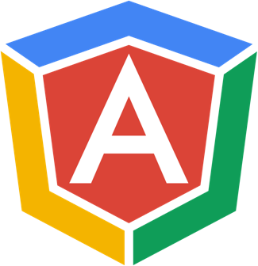

# [ng-conf 2015](http://ng-conf.org/) submissions

ng-conf 2015 is March 5-6th 2015 in Salt Lake City, Utah. 
We're looking for speakers who are passionate about sharing deep insights, useful tools, and crazy awesome ideas.

## How to Submit a Proposal

1. Fork this repository
2. Create a new directory with a short name (no spaces) that represents your topic e.g. 'rich-ng-models' or 'loving-promises'.
3. In that directory add a high quality 500x500 picture of yourself, named `profile.jpg`, to be used in the schedule if your submission is selected.
4. In that directory create a "proposal.yaml" file, using the [proposal template](./template/proposal.yaml).
   Make sure the file remains [valid yaml](http://yamllint.com/).
   For sessions with multiple speakers just add a "Speaker2" following the same format.
5. Commit your changes and submit a [pull request](https://help.github.com/articles/creating-a-pull-request) back to this repo.
6. If you have multiple proposals, repeat this process for each submission

Selected submissions will have their pull request merged into master. Best of luck!
